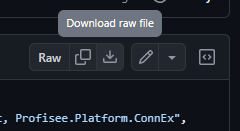
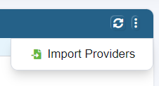

# Connectors
This repository contains the Profisee Connectors.

## Importing a Connector into Profisee
1. Find the connector you want to import (e.g. [Melissa Data Personator](Melissa%20Data%20Personator/Personator%20Consumer_v3.json))
2. Click the "download raw file" button

   
3. Find the downloaded file
4. Go to the Profisee Portal
5. Navigate to Administration > Connect > Service Providers
6. Click on the ellipsis in the top right of the grid and choose "Import Providers"
   
   
7. Select the file that you downloaded and click "Open"